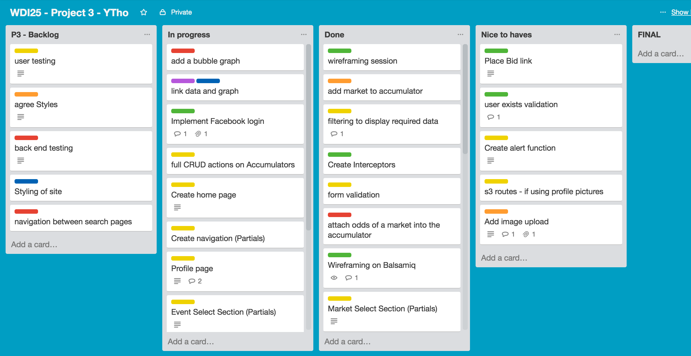

# Project 3
Ben Currie
Fabricio Ferreira
Sam Wakefield
Roman Stankiewicz

# Bet Bucket - Accumulator App

### GA WDI London - Project 3 - Team Project

#### An application for obtaining betting data with which to build accumulators, with odds which can be tracked in real time.  

The site is designed to enable a user to obtain information on events by category, event and outcome and build an accumulator bet with the data.  The API used is provided by Betfair.

XXX

##### [Link to App](https://powerful-mountain-XXXXX.herokuapp.com/)

#### Home Screen

The welcome screen shows XXX.  From this page, users must login and authenticate by registering through the app directly.

#### Profile page

The profile page is the main single page which is accessible only by the user that created it.  It shows a side panel with all accumulators the user has active. The main view builds out depending on the activity being carried out.

<!-- INSERT IMAGES HERE -->

#### Profile Page - Create an Accumulator

The user simply clicks on the 'new accumulator' button and assigns a name to it.  An empty accumulator is created.

#### Add Events to an Accumulator

The user clicks on the Accumulator to make it active. They  click 'add event' and start their search to find an Event Type.
Event Types available are:
* Soccer
* Tennis
* Golf
* Cricket
* Rugby
* Boxing
* Horse
* Motor
* Special

Once an Event Type is selected, the individual event is searched for.  This could include a competition such as Champions League in Soccer or Grand National in Horses for example.  There are also special events which cater for elections, reality tv show outcomes and awards winners for example.

Once the individual event is selected, the user can drill down to the specific outcome which they require odds for.  A final click on this and the event outcome and odds are added to the accumulator bucket.

#### Viewing the Accumulator

Once the accumulator is populated the user can view the progress of the odds to maximise the payout they might win.  The API is called at XXX intervals and while the odds update automatically per line item, so too does the graph to give a visual representation of the trend of the odds.

The graph automatically shows when an accumulator is selected and starts its updates once the use is logged in and an accumulator is selected.

#### Approach / How It Works

This is a full stack application which utilises RESTful routing and authentication.

Secure routes ensure that only registered users can access the site.

##### APIs used

1. Betfair Betting API
<!-- XXX - internal API - (which does what???) XXXX -->

#### The Build

The following tools are used to build the site.

* Javascript
* AngularJS
* Bootstrap SCSS
* Charts.js
<!-- * MongoDB -->

In addition, the following planning and management tools were used:

* Trello for project management

* Balsamiq for the wireframing

#### Problems & Challenges

The greatest challenges were:

1. accessing the API as initially, the session tokens kept expiring
2. making sense of the API documentation which was complicated and assumed higher then a beginners knowledge of programming and gambling.
3. identifying the correct filters and data sets to make the data meaningful to a user.

#### Wins

1. understanding the complex Betfair API documentation to access the data required
2. linking the API data to graphs for real-time visualisation of the performance of an accumulator.
