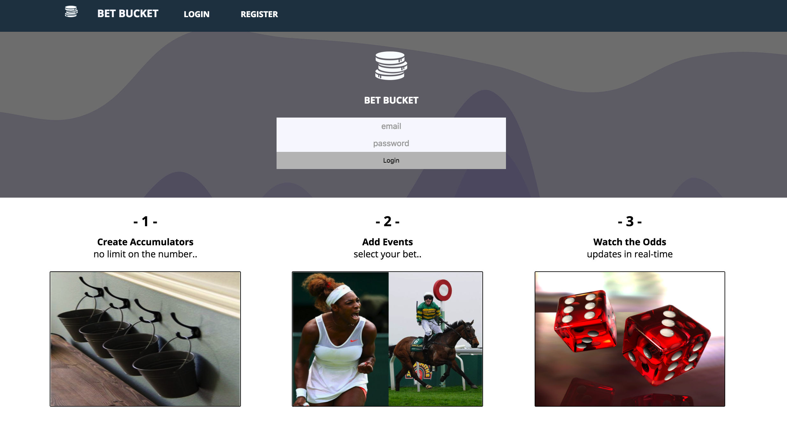
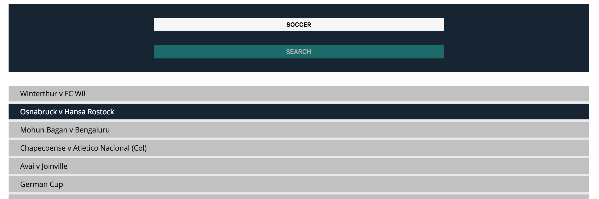
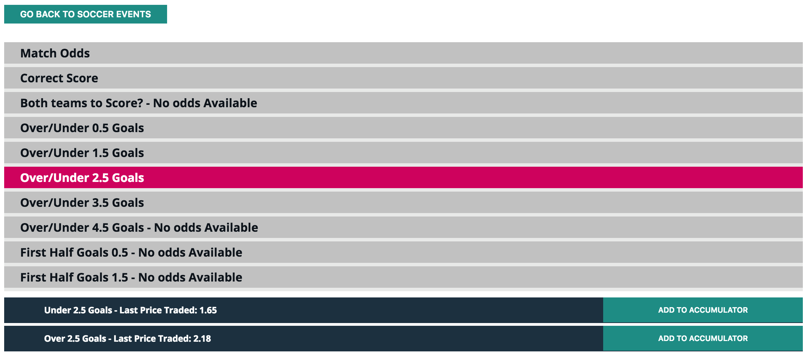
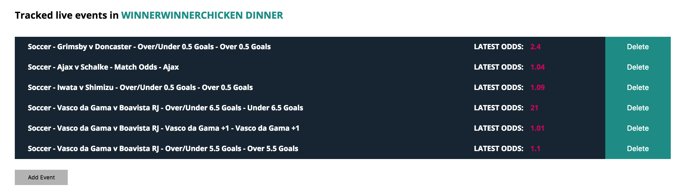

# Project 3
Fabricio Ferreira
Sam Wakefield
Roman Stankiewicz
Ben Currie

# Bet Bucket - Accumulator App

### GA WDI London - Project 3 - Team Project

#### An application for obtaining betting data with which to build accumulators.  Betting odds are tracked in real time.  

The site is designed to enable a user to obtain information on sporting and 'special' events by category, event and outcome and build an accumulator bet with the data.  The API used is provided by Betfair.

The accumulator can hold any amount of events, and the data will automatically update a live graph which tracks the odds.

  [Link to App](http://powerful-mountain-50329.herokuapp.com/login)

#### Home Screen

The landing page is simple, showing a route to login and a brief description of the app. 

1. Create accumulator
2. Add events
3. Track odds

From this page, users must login and authenticate by registering through the app directly.

#### Profile page

The profile page is the main single page which is accessible only by the user that created it.  It shows a side panel with all accumulators which the user owns. The main view builds out depending on the activity being carried out with the accumulator, by the user.

#### Add Events to an Accumulator

The user clicks on the Accumulator to make it active. They  click 'add event' and start their search to find an Event Type.

Event Types available are:

* Soccer
* Tennis
* Golf
* Cricket
* Rugby
* Boxing
* Horse
* Motor
* ESports
* Special

Once an Event Type is selected, the individual event is searched for.  This could include a competition such as Champions League in Soccer or Grand National in Horses for example.  There are also special events which cater for elections, reality tv show outcomes and awards winners for example.

Once the individual event is selected, the user can drill down to the specific outcome which they require odds for.  A final click on this and the event outcome and odds are added to the accumulator bucket.

#### Viewing the Accumulator

Once the accumulator is populated the user can view the progress of the odds to maximise the payout they might win.  The API is called at 1 second intervals and while the odds update automatically per line item, so too does the graph to give a visual representation of the trend of the odds.

The graph automatically shows when an accumulator is selected and starts its updates once the user is logged in and an accumulator is selected. See Graph above as an example.

#### Approach / How It Works

This is a full stack application which utilises RESTful routing and authentication.

Secure routes ensure that only registered users can access the site.

The API is key to the functionality of the app.  It calls data constantly to maintain the correct odds, providing the data to update the graphs at a rate of once every second.

Angular charts provides real time charting capability.

##### APIs used

1. Betfair Betting API
2. Internal API - for users and accumulators

#### The Build

The following tools are used to build the site.

* Javascript
* AngularJS
* SCSS
* Charts.js

In addition, the following planning and management tools were used:

**Trello for project management**

Trello allowed for detailed planning and allocation of tasks.  Bi-daily updates were made to progress activity and ensure that all outstanding were completed by an agreed time. 

Trello was a key component of our project management capability.

**Balsamiq for wireframing**

Balsamiq helped us to plan out the views correctly, along with the flow.  While this is a compact site, there is a lot of data behind the scenes, which is available to the app, so visualising this correctly was crucial.

#### Problems & Challenges

The greatest challenges were:

1. Accessing the API as initially, the session tokens kept expiring
2. Making sense of the API documentation which was complicated and assumed higher then a beginners knowledge of programming and gambling.
3. Identifying the correct filters and data sets to make the data meaningful to a user.
4. Using the data!

#### Wins

1. Understanding the complex Betfair API documentation to access the data required.
2. Linking the API data to the graphs for real-time visualisation of the performance of an accumulator.
